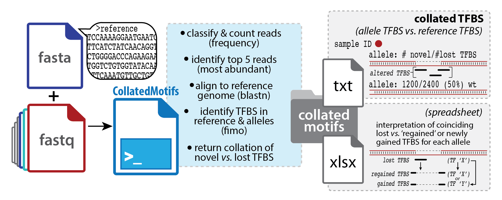
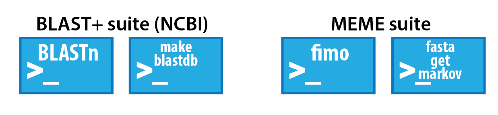
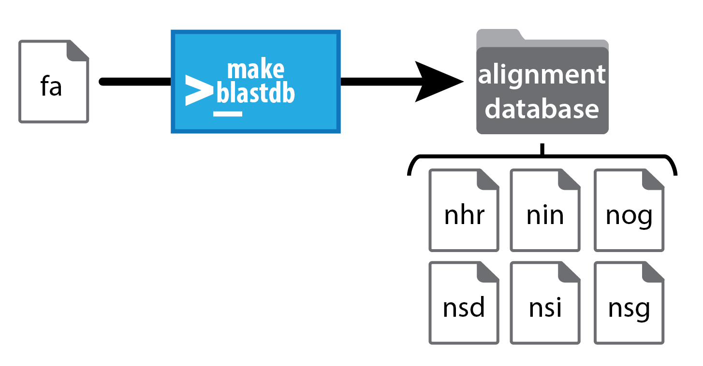
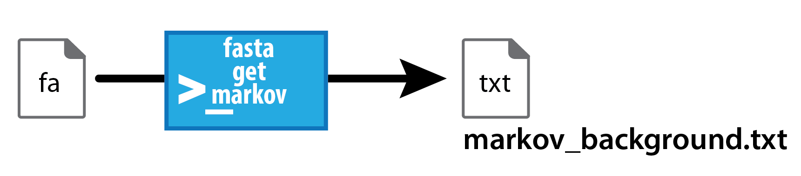
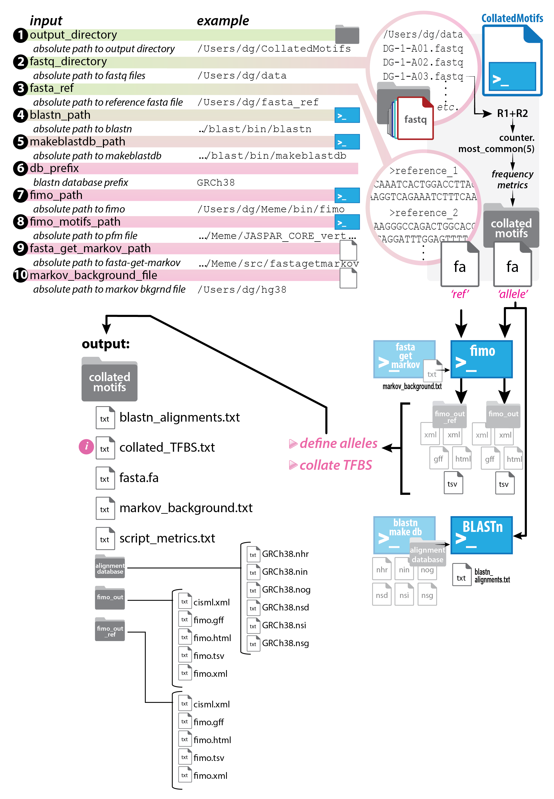
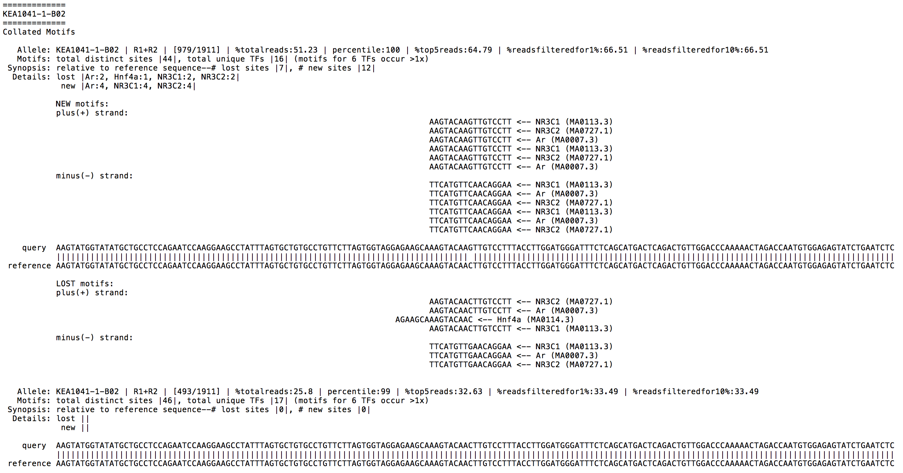

# <span style="color:darkturquoise">CollatedMotifs.py</span>

Define alleles for deeply sequenced genetic loci (PCR amplicons), and summarize loss or gain of transcription factor binding site (TFBS) motif matches relative to reference DNA sequence(s).  
<br/> 
## <span style="color:darkturquoise">Table of contents</span>
* [Background](#background)  
* [Features](#features)  
* [Requirements](#requirements)  
* [Synopsis](#synopsis)  
* [System setup](#system-setup)  
	* [Option 1: Virtual machine](#virtual-machine)    
	* [Option 2: Direct install](#direct-install)    
		* [2.1 Python 3 setup](#21-python-3-setup)  
			* [Python 3 (required)](#python-3-required)  
			* [Anaconda (Optional: Python 3 with Jupyter Notebook in one)](#anaconda-optional-python-3-with-jupyter-notebook-in-one)  
				* [Anaconda on Mac](#anaconda-on-mac)  
				* [Anaconda on Linux](#anaconda-on-linux)  
				* [Anaconda on Windows](#anaconda-on-windows)  
			* [Jupyter Notebook (optional)](#jupyter-notebook-optional)  
		* [2.2 GitHub repository](#22-github-repository)  
		* [2.3 Python 3 libraries](#23-python-3-libraries)  
			* [Libraries in default python](#libraries-in-default-python)  
			* [Libraries in virtual python environment](#libraries-in-virtual-python-environment)  
		* [2.4 External dependencies](#24-external-dependencies)
* [Code launch notes](#code-launch-notes)  
	* [Launching .py program](#launching-py-program)
		* [Command line .py](#command-line-py)
		* [Command line .py in virtual environmnet](#command-line-py-in-virtual-environment)
	* [Launching .ipynb program](#launching-ipynb-program)
		* [Jupyter Notebook .ipynb](#jupyter-notebook-ipynb)
		* [Jupyter Notebook .ipynb in virtual environmnet](#jupyter-notebook-ipynb-in-virtual-environment)
* [Operation notes](#operation-notes)  
* [Input notes](#input-notes)  
* [Output notes](#output-notes)  
* [Visual summary of key script operations](#visual-summary-of-key-script-operations)  
* [Status](#status)  
* [Contact](#contact)  
  

## <span style="color:darkturquoise">Background</span>
DNA sequence-selective **transcription factors (TFs)** mediate gene regulation; their interactions with DNA contribute to the formation of nucleoprotein structures that modulate transcription at target genes. These functional units -- **response elements** (*e.g.*, enhancers/*cis*-regulatory modules) -- integrate cellular signals to regulate the types of gene transcripts produced by a cell, and when and how much of each transcript type is made. Genomic editing by programmable nucleases (*e.g.*, CRISPR-Cas9) routinely yields mixed allelic mutation at target loci (*e.g.*, variable insertion *vs.* deletion, indel length across edited cells). For editing efforts targeted to putative response elements, widely available pattern-matching tools enable prediction of transcription factor binding sites (TFBS) at altered loci, based on matches to position frequency matrices of known TFs. *Awareness of altered TFBS in edited alleles can aid prediction and/or interpretation of functional consequences associated with mutations.* 

**This script returns sequence matches to TFBS motifs for samples from a demultiplexed next-generation sequencing (NGS) fastq dataset.  Provided with a reference sequence, the script returns TFBS motif matches collated as 'new' or 'lost' relative to the reference sequence.**  

<br clear="all" />


## <span style="color:darkturquoise">Features</span>
* Automates allele definitions for amplicons deeply sequenced on Illumina® platforms; identifies matches to TFBS motifs in allele sequences and in user-provided reference sequence(s); presents summation of 'lost' *vs.* 'gained' motif matches in alleles relative to reference sequence.
* Input: demultiplexed fastq files; fasta file(s) containing reference sequence(s) for alignment and TFBS comparison; positional frequency matrix database file (MEME format).
* Outputs: TFBS comparison in alleles relative to reference sequence(s).

## <span style="color:darkturquoise">Requirements</span>
* **Mac or Linux OS** note that FIMO is not compatible with Windows OS. For Windows users interested in running CollatedMotifs, we recommend installation of **Alleles\_and\_altered\_motifs.ovf**, which contains all the requirements within a Linux virtual machine
* Python 3 - instructions for install below
* Python libraries (numpy, pip, psutil, scipy, setuptools, and wheel) - instructions for install below
* BLASTN (NCBI)<sup>1</sup>  
* MAKEBLASTDB (NCBI)<sup>1</sup>  
* FIMO (MEME)<sup>2</sup>   
* FASTA-GET-MARKOV (MEME)<sup>2</sup>   
   
 <sup>1</sup> **BLAST+ suite** available for download @ <a href="https://blast.ncbi.nlm.nih.gov/Blast.cgi?PAGE_TYPE=BlastDocs&DOC_TYPE=Download">Download BLAST Software and Databases</a>)  
 <sup>2</sup> **MEME suite** available for download @ <a href="http://meme-suite.org/doc/download.html">Download MEME Suite and Databases</a>)  
  <sup>1,2 </sup> See also [2.4 External dependencies](#24-external-dependencies) for exta notes on downloading & installing external dependencies (BLAST, MEME)


  
## <span style="color:darkturquoise">Synopsis</span>
**This script returns alleles and TFBS collated as 'new' or 'lost' relative to a reference sequence, for sample-specific amplicons deeply sequenced on Illumina® sequencing platforms.**
>(see '[Output notes](#output-notes)' for file output details).  


**Users are asked for paths to (1) an output directory, (2) fastq directory (sample sequence sources), (3) BLASTN executable, (4) MAKEBLASTDB executable, (5) FIMO executable, (6) FASTA-GET-MARKOV executable, (7) BLAST reference sequence file (+prefix common to database files), (8) fasta file with reference sequence(s) to be queried as basis for TFBS comparison, and (9) positional frequency matrix file (Meme format) for TFs.**

>(see '[Input notes](#input-notes)' for details).
    
For further usage details, please refer to the following manuscript:  
>*Ehmsen, Knuesel, Martinez, Asahina, Aridomi, Yamamoto (2021)*
    
Please cite usage as:  
>CollatedMotifs.py  
>*Ehmsen, Knuesel, Martinez, Asahina, Aridomi, Yamamoto (2021)*


## <span style="color:darkturquoise">System setup</span>   

### <span style="color:mediumturquoise">Virtual machine<span>   
---
#### <span style="color:mediumturquoise">Alleles\_and\_altered\_motifs.ovf</span>   

The programs are available for use either individually or packaged into a virtual machine which can be run on Mac, Linux, or Windows operating systems. The "Alleles_and_altered_motifs" virtual machine comes pre-installed with BLAST, MEME, the full hg38 genome BLAST database, test datasets, and all the external dependencies needed to run SampleSheet, CollatedMotifs, and Genotypes. Windows users are encouraged to use the virtual machine to run CollatedMotifs because the MEME suite software upon which CollatedMotifs relies is not natively supported on Windows OS.

* Detailed instuctions on Virtual machine download and setup at <a href="https://doi.org/10.5281/zenodo.3406861">Download Alleles\_and\_altered\_motifs virtual machine</a> from Zenodo,  DOI 10.5281/zenodo.3406861

* Note: Running the virtual machine requires virtualization software, such as Oracle VM VirtualBox available for download at <a href="https://www.virtualbox.org/">Download virtualbox Software</a> https://www.virtualbox.org/


Linux and Mac users can also follw the steps below to install SampleSheet, Genotypes, and CollatedMotifs. If you are running Windows, you can follow the steps below to install SampleSheet and Genotypes (without CollatedMotifs).


### <span style="color:mediumturquoise">Direct install<span>  
---
#### <span style="color:mediumturquoise">2.1. Python 3 setup</span>

<span style="color:mediumturquoise"> First confirm that Python 3 (required) and Jupyter Notebook (optional) are available on your system, or download & install by following the steps below</span>   


Mac and Linux OS generally come with Python pre-installed, but Windows OS does not.  Check on your system for the availability of Python version 3.7 or higher by following guidelines below:  
 
- First open a console in Terminal (Mac/Linux OS) or PowerShell (Windows OS), to access the command line interface.  
 
-  Check to see which version of Python your OS counts as default by issuing the following command (here, `$` refers to your command-line prompt and is not a character to be typed):  
     
	`$ python --version` 
	 
 	- If the output reads `Python 3.7.3` or any version >=3.7, you are good to go and can proceed to [Jupyter Notebook (optional)](#jupyter-notebook-optional).  
 
 	- If the output reads `Python 2.7.10` or anything below Python 3, this signifies that a Python version <3 is the default version, and you will need to check whether a Python version >=3.7 is available on your system.  
 		- To check whether a Python version >=3.7 is available on your system, issue the following command:  
 
 			`$ python3 --version`  
 
 		- If the output finds a Python version >=3.7 (such as `Python 3.7.3`), you are good to go and can proceed to [Jupyter Notebook (optional)](#jupyter-notebook-optional).
		- If the output does *not* find a Python version >3.7, use one of the following two options to download and install Python version >=3.7 on your computer:  

##### <span style="color:mediumturquoise">Python 3 (required)</span>
Option 1) Install Python 3 prior to Jupyter Notebook **This option is recommended for most users**   
   
* Go to the following website to download and install [Python](https://www.python.org/downloads/) https://www.python.org/downloads/  
	* Select "Download the latest version for X", and then follow installation guidelines and prompts when you double-click the downloaded package to complete installation.  
	* Once you have downloaded and installed a Python 3 version >=3.7, double-check in your command-line that Python 3 can be found on your system by issuing the following command:  
 	
 		`$ python3 --version` 
 		
	* The output should signify the Python version you just installed.  Proceed to [Jupyter Notebook (optional)](#jupyter-notebook-optional).


##### <span style="color:mediumturquoise">Anaconda (Optional: Python 3 with Jupyter Notebook in one)</span>
 
Option 2) Install Python 3 and Jupyter Notebook (together as part of Anaconda package)   
   
* Note, this method has *only been tested for use of SampleSheet.py and Genotypes.py on Windows* and may not work on all Mac or Linux systems in conjunction with the use of Python Virtual Environments (virtualenv) to run CollatedMotifs.py**  
   
* [Anaconda (with Jupyter Notebook) Download & Installation](https://jupyter.readthedocs.io/en/latest/install/notebook-classic.html) https://jupyter.readthedocs.io/en/latest/install/notebook-classic.html
	* Download Anaconda with Python 3, and then follow installation guidelines and prompts when you double-click the downloaded package to complete installation.  

 
###### <span style="color:mediumturquoise">Anaconda on Mac</span>
Anaconda with Jupyter Notebook on Mac   

* Anaconda with Jupyter Notebook installed on a Mac/Linux OS will install the “Anaconda-Navigator” application in Applications folder. Within the Anaconda-Navigator application the user will find:

	>Jupyter Notebook  


* Jupyter Notebook can be launched by clicking the "Launch" icon from within the Anaconda-Navigator
  			- Alternatively, Jupyter Notebook can be launched in terminal by one of the following commands: `$ jupyter notebook` or `$ jupyter-notebook` (version/system specific) to open Jupyter Notebook through a selected internet browser (Google Chrome and FireFox have been tested)
 			
###### <span style="color:mediumturquoise">Anaconda on Linux</span>
Anaconda with Jupyter Notebook on Linux   

* To install Anaconda on Linux, open terminal and navigate to the folder where Anaconda script (for example Anaconda3-2020.11-Linux-x86_64.sh) was downloaded.  
	* Change the permissions to allow script execution with the chmod +x command, for example:
  	`$ chmod +x Anaconda3-2020.11-Linux-x86_64.sh` 
	* Open the shell script with the ./ command, for example:
  	`$ ./Anaconda3-2020.11-Linux-x86_64.sh`
	* Follow the on-screen prompts and answer "yes" to, "Do you whish the installer to initialize Anaconda3 by running conda init? [yes|no]"  
	* When the install is finished, restart terminal to initiate the new settings
	* Anaconda navigator can be opened by the following command in a new terminal
  	`$ anaconda-navigator`
	* Jupyter Notebook can be opened through a selected internet browser (Google Chrome and FireFox have been tested) by selecting "Launch" on the Jupyter Notebook icon from within the home screen of the Anaconda Navigator. Note: (base) may appear at the far left of the terminal when Anaconda is activated
	* To deactivate Anaconda and revert to your default Python settings, run the following terminal command:
  	`$ conda deactivate` 
	* To reactivate Anaconda and allow use of anaconda-navigator, run the following terminal command:
   	`$ conda activate`
   	(base) altered@tfbs:~$ conda deactivate\
	* The version of Python and Jupyter Notebook used by your system will be determined by these commands. For example:

						(base) $ conda deactivate
						$ which python
						/usr/bin/python
						$ which jupyter-notebook
						/usr/bin/jupyter-notebook						
						
						$ conda activate
						(base) $ which python
						/home/altered/anaconda3/bin/python
						(base) $ which jupyter-notebook
						/home/altered/anaconda3/bin/jupyter-notebook

	* If you wish to open new default terminals with anaconda deactivated, add the `$ conda deactivate` command after the conda init code in your .bashrc file and use the `$ conda activate` command prior to use of the `$ anaconda-navigator` when opening Jupyter Notebooks  
	
###### <span style="color:mediumturquoise">Anaconda on Windows</span>

Anaconda with Jupyter Notebook on Windows for use with SampleSheet.py and Genotypes.py only:
  			
* Anaconda with Jupyter Notebook installed on a Windows OS will make a separate “Anaconda3 (64 bit)” folder available through the start menu and is kept separate from any other version of Python or Jupyter Notebook on your system. In the Anaconda 3 (64 bit) folder, the user will find:

>Anaconda PowerShell Prompt (Anaconda 3)     
>Jupyter Notebook (Anaconda 3)   
   
Jupyter Notebook can be run through Anaconda in Windows by opening the “Jupyter Notebook (Anaconda 3)” program from the start menu or from within the Anaconda PowerShell (Anaconda 3) program by one of the following commands: `$ jupyter notebook` or `$ jupyter-notebook` (version/system specific) to open Jupyter Notebook through a selected internet browser (Google Chrome and FireFox have been tested, Internet Explorer and Microsoft Edge should also be compatible)   
   
			
#### <span style="color:mediumturquoise">Jupyter Notebook (optional)<span>
*Note, these steps are not required to run the command line CollatedMotifs.py, but are necessary to run the browser-based Jupyter Notebook CollatedMotifs.ipynb*.  

- Jupyter Notebook is *not* generally pre-installed on Mac/Linux OS.  To check whether Jupyter Notebook is available with Python 3 on your machine, issue the following command:   

	`$ which jupyter-notebook` (Mac/Linux OS)  
	`$ where.exe jupyter-notebook` (Windows PowerShell)   
   
- If the output indicates that 'jupyter' is available in the path of your Python 3 installation (such as, `/Library/Frameworks/Python.framework/Versions/3.7/bin/jupyter`), you are good to go and can proceed to **Download the CollatedMotifs repository (or program subset) from GitHub**.  If instead you see an error message indicating that 'jupyter notebook' is not available, issue the following commands using the Python program installer (pip) to install Jupyter:  
  
 	`$ pip3 install --upgrade pip`  
	`$ pip3 install jupyter`  
	
**Confirming Jupyter Notebook**   
  			
 - Users can check Jupyter Notebook locations the terminal (Mac/Linux OS) or Anaconda PowerShell Prompt (Windows OS) by issuing the following command:  
	`$ which jupyter-notebook` (Mac/Linux OS)  
	`$ where.exe jupyter-notebook` (Windows PowerShell)  
	
- If the output indicates that 'jupyter' is available in the path of your Python 3 installation (such as, `/Library/Frameworks/Python.framework/Versions/3.7/bin/jupyter-notebook` (Mac/Linux OS) or `C:\Users\[user]\AppData\Local\Programs\Python\Python37\Scripts\jupyter-notebook.exe` (Windows PowerShell)), you are good to go and can proceed to **Download the CollatedMotifs repository (or program subset) from GitHub**.  


<br>  


#### <span style="color:mediumturquoise">2.2. GitHub repository</span>

Download the ColllatedMotifs repository (or program file subset) from GitHub

CollatedMotifs.py can be accessed as a **Jupyter Notebook** or **Python program file** available at [YamamotoLabUCSF GitHub](https://github.com/YamamotoLabUCSF/CollatedMotifs) (https://github.com/YamamotoLabUCSF/CollatedMotifs).  Please note that access to the file through GitHub requires a personal GitHub account.  

* (a) **Create a personal GitHub account** (free)  
	* follow instructions available at [WikiHow: How to Create an Account on GitHub](https://www.wikihow.com/Create-an-Account-on-GitHub) https://www.wikihow.com/Create-an-Account-on-GitHub. 

* (b) **Navigate to the code repository for CollatedMotifs**
	* The code repository contains:
		* the **Jupyter Notebook** file (.ipynb)
		* the **Python program** file (.py)
		* **image files** associated with the Jupyter Notebook
		* a **requirements** file (CollatedMotifs_requirements.txt), used install all Python dependencies and/or in the creation of a Python virtual environment to run CollatedMotifs (see **[2.3 Python 3 libraries](#23-python-3-libraries)**, below)
		
* (c) **Download** or **clone** the repository to your personal computer:  

	**Download:**   
	* first click on the repository name to access the repository
	* then download the entire repository directory and its associated subdirectories and files (**green download icon, labeled "Code"**)
	* alternatively, download only the target files you need for your intended purposes 
	  * for example, download the **Jupyter Notebook** file (.ipynb), **image files directory**, and **requirements** file if you plan to use only the Jupyter Notebook

	**Clone:**   
	  
	* first click on the repository name	 to access the repository
	* then click on the right-hand arrow of the **green download icon, labeled "Code"**, to access the drop-down menu with **Clone** options (HTTPS or GitHub CLI).
	* If selecting the HTTPS option, copy the indicated URL and paste it at your command-line as an argument to the command 'git clone':  
	`$ git clone https://github.com/YamamotoLabUCSF/CollatedMotifs.git` 

* (d) **Choose a directory location** on your machine where you would like to store the downloaded or cloned repository and its files.  This can be any folder/directory location you like.  **Move the repository files from the directory into which they were downloaded or cloned, into this directory**, if you have not already downloaded or cloned the repository/files directly into your target directory.  

	*Example using command line code*  
	*(directory can be created and accessed using command line prompts)*   
	* For example, on Mac OS:  
	
		* To create an empty directory named 'CollatedMotifsCode', in the 'Documents' directory:*  
	`$ mkdir /Users/yourusername/Documents/CollatedMotifsCode`
		* To navigate to the directory named 'CollatedMotifsCode':	`$ cd /Users/yourusername/Documents/CollatedMotifsCode`

	* For example, on Windows PowerShell:  
	 
		* To create an empty directory named 'CollatedMotifsCode', in the 'Documents' directory:  
	`$ mkdir ~/Documents/CollatedMotifsCode`
		* To navigate to the directory named 'CollatedMotifsCode':  
	`$ cd ~/Documents/CollatedMotifsCode`

* (e) Transfer the CollatedMotifs repository files to this directory you've created and named
* (f) Navigate to the **CollatedMotifs** repository in the command line
 
<br>  
 
#### <span style="color:mediumturquoise">2.3. Python 3 Libraries</span>

Python 3 Libraries (required) and virtual environment (optional)

You are now ready to install **additional Python modules** that CollatedMotifs.py requires for operation.  These Python modules can be installed using one of the following two options:

* Option A) Use the pip3 command to automatically download the required libraries from the Python Package Index repository ([PyPI](https://pypi.org/)) (https://pypi.org/) and install them into your primary Python 3 directory from the requirements file, 'CollatedMotifs_requirements.txt'. This method is the most simple to execute and will be outlined first.

* Option B) Install a Python **virtual environment** (self-contained 'directory' with all the Python modules needed to run CollatedMotifs.py). This method retains your original Python 3 install unchanged, protecting it from any possible library version conflicts that may arise from installing or updating the CollatedMotifs.py required libraries.  
  
##### <span style="color:mediumturquoise">Libraries in default Python</span>  
  
**Option A) Direct Python 3 library install**

1. Install the Python modules required by CollatedMotifs.py, using the requirements file named **CollatedMotifs_requirements.txt**, located in the CollatedMotifs repository:
	   
	`$ pip3 install -r CollatedMotifs_requirements.txt`  
	
	pip3 is Python 3's installation manager, and as long as there is an internet connection available, pip3 will access the specified module from PyPI and install it for access by Python 3.
	
2. To check that the required CollatedMotifs.py Python modules were installed properly, now issue the follow command:
	
	`$ pip3 list | grep -E 'numpy|psutil|scipy|'`
	
	If the library install was a success, the output will read the following (note the package version numbers may differ, but all packages should be listed):
	  
  |**Package**|    **Version**|    
  |:--|:--|
  |numpy      | 1.19.2 |  
  |psutil     | 5.7.2  |
  |scipy      | 1.5.2  |

##### <span style="color:mediumturquoise">Libraries in virtual python environment</span> 

**Option B) Python 3 library install via a virtual enviornment**

1.  First, install the Python module **virtualenv** ([virtualenv](https://pypi.org/project/virtualenv/)) (https://pypi.org/project/virtualenv/), by issuing the following command at the command line: 
 
	`$ pip3 install virtualenv`  
	
	pip3 is Python 3's installation manager, and as long as there is an internet connection available, pip3 or pip will access the specified module from PyPI (here, virtualenv) and install it for access by Python 3.

2. Next, choose a **directory location** on your machine where you would like to install the files associated with a virtual environment.  This can be any folder/directory location you like (for example, you may have a favorite directory where other Python virtual environments are stored).  Alternatively, simply create the Python virtual environment in the CollatedMotifsCode directory you created above (in section 2d).  At the command line, navigate to the location of this directory.
	* For example:
		* To navigate to the directory named 'CollatedMotifsCode':  
		`$ cd ~/Documents/CollatedMotifsCode`

3. With this directory set as your working location in the command line, now issue the following commands to **create a virtual environment**:  
	
	(a) Create a Python virtual environment named **CollatedMotifs_env**, specifying that the environment will use Python 3:  
	`$ virtualenv -p python3 CollatedMotifs_env` 
	
	(b) Activate CollatedMotifs_env:   
	`$ source CollatedMotifs_env/bin/activate` (Mac/Linux OS)
	or
	`$ .\CollatedMotifs_env\Scripts\activate` (Windows PowerShell) 
			
	(c) You should now see that your command line prompt has changed to indicate that you are in the virtual environment, displaying something along the lines of:  
	`(CollatedMotifs_env) $`
	
	(d) Now install the Python modules required by CollatedMotifs.py, using the requirements file named **CollatedMotifs_requirements.txt**, located in the CollatedMotifs repository:
	   
	`$ pip3 install -r CollatedMotifs_requirements.txt`  	
	
	(e) To check that the required CollatedMotifs.py Python modules were installed properly, now issue the follow command:
	
	`$ pip3 list`
	
	If the virtual environment was set up successfully, the output will read the following (note the package version numbers may differ, but all packages should be listed):  
	
  |**Package**|    **Version**|    
  |:--|:--|
  |numpy      | 1.19.2 |  
  |psutil     | 5.7.2  |
  |scipy      | 1.5.2  |


4. Finally, Jupyter Notebook needs to be made aware of the Python virtual environment you just created.  To accomplish this, issue the following commands:  

	```$ pip3 install ipykernel```   
	```$ python -m ipykernel install --name=CollatedMotifs_env```  
note administrator privilages may be needed on your system in which case use the following command
	```$ pseudo python -m ipykernel install --name=CollatedMotifs_env```  
followed by your administrator password

*  You should now be ready to **access CollatedMotifs.ipynb** in Jupyter Notebook or at the command line!

*  Just for completeness, to **exit the Python virtual environment and return to your 'native' (default) environment**, simply issue the following command at the command line:

	``$ deactivate`` 
	
	To **re-enter the virtual environment** at any time in the future, you would use the command in 3b:
	
	`$ source CollatedMotifs_env/bin/activate`  (Mac/Linux OS)  
	or  
	`$ rm CollatedMotifs_env -r -fo`  (Widows PowerShell) 


* Also, note that if you'd like **to remove the CollatedMotifs_env at any time**, you can do so by issuing the following command:  

	`$ rm -rf CollatedMotifs_env`  (Mac/Linux OS)  
     or  
	`$ rm SampleSheet_env -r -fo`  (Widows PowerShell)  

	This would delete the virtual environment from your machine.

<br>   

#### <span style="color:turquoise">2.4 External dependencies</span>

*Additional setup*:  

* Locally install **BLASTN**, **MAKEBLASTDB**, **FIMO**, and **FASTA-GET-MARKOV**

<br clear="all" />

* See [Requirements](#requirements) 
* *Note, separate installation of these external dependencies is not necessary if using the virtual machine file Alleles\_and\_altered\_motifs.ovf*


**Additional notes on: </sup> BLAST+ suite** available for download @ <a href="https://blast.ncbi.nlm.nih.gov/Blast.cgi?PAGE_TYPE=BlastDocs&DOC_TYPE=Download">Download BLAST Software and Databases</a>)  

* NCBI recommends Mac users install using the ncbi-blast-2.2.18+.dmg file.
* MacOS 10.15 and higher have enhanced security that will require extra steps to install the ncbi-blast-2.2.18+.dmg
	* With Mac OS 10.15 or higher, you may encounter a ' "ncbi-blast-2.11.0+.pkg" cannot be opened because it is from an unidentified developer' error.
	* If so, click on the question mark on the bottom left of the error window and follow the on-screen instructions to open the General Security Pane and allow the install.
* The default BLAST install location from the .dmg file is: `/usr/local/ncbi/blast`


**Additional notes on: </sup> MEME suite** available for download @ <a href="http://meme-suite.org/doc/download.html">Download MEME Suite and Databases</a>)  

* CollatedMotifs.py only uses a small subset of the MEME Suite.
* The MEME Suite has several internal dependencies that do not affect CollatedMotifs.py
	* The 'make test' step of MEME setup may result in a 'FAIL: meme-chip1 (missing summary.tsv)' error - This is due to a missing Perl dependency and will not affect CollatedMotifs.py.
	* meme-chip1 is not used in SampleSheet.py, CollateMotifs.py, or Genotypes.py so this error can be ignored.
* After MEME install, the following line should be added to the end of your `.zshrc` file to add MEME to your path and allow CollatedMotifs.py to call upon it for use: `PATH=/Users/yourusername/meme/bin:/Users/yourusername/meme/libexec/meme-5.3.0:$PATH` replacing 'yourusername' with your specific user name.
	* If you do not have a `.zshrc` in your home directory create one with a text editor and add the command.
	* use caution any time you are editing a system file such as `.zshrc` and prepare a backup of the file before editing.
* The default install location of FIMO is:   
	`/Users/[user]/meme/bin/fimo`
* The default location of MEME 'fasta-get-markov' is:   
	`/Users/[user]/meme/libexec/meme-5.3.0/fasta-get-markov`   

<br>  

## <span style="color:darkturquoise">Code launch notes</span>  
  
Code is available as a Jupyter Notebook file (**CollatedMotifs.ipynb**) or as a Python program file (**CollatedMotifs.py**) for direct use, or pre-packaged with all dependencies as an Open Virtualization Format file for virtual machines (**Alleles\_and\_altered\_motifs.ovf**).  

### <span style="color:mediumturquoise">Python program (CollatedMotifs.py) or Jupyter Notebook (CollatedMotifs.ipynb)</span>

In [System setup](#system-setup) above, you downloaded and installed Python 3 & the CollatedMotifs code repository.  Optionally, you may have also installed Jupyter Notebook & created a Python virtual environment (CollatedMotifs\_env) containing the Python modules that CollatedMotifs.py needs in order to run.  To access CollatedMotifs.py (Jupyter Notebook or Python program file) for interactive work, proceed through guidelines indicated below.  


#### <span style="color:mediumturquoise">Launching .py program</span>
##### <span style="color:mediumturquoise">Command line .py</span>


* To start the CollatedMotifs.py program directly from the command line, enter the following command:

	`$ python3 [path_to_CollatedMotifs.py]/CollatedMotifs.py`

* For example, if you installed CollatedMotifs.py within the CollatedMotifsCode folder on your desktop the command would be:

	`$ python3 ~/Desktop/CollatedMotifsCode/CollatedMotifs.py`

*  If these steps have been accomplished successfully, you will now encounter the first interactive prompts of CollatedMotifs.py.  Be prepared to provide required input variables as detailed below in **[Input Notes](#input-notes)**.

##### <span style="color:mediumturquoise">Command line .py in virtual environment</span>

1.  If you plan to run CollatedMotifs.py using the CollatedMotifs_env Python3 virtual environment from your command line, first navigate to the directory containing **CollatedMotifs.py**.  Prepare access to a Python virtual environment containing appropriate packages required by CollatedMotifs.py, as described in [System setup](#system-setup).  

    (a) Activate CollatedMotifs_env:   
	`$ source CollatedMotifs_env/bin/activate` (Mac/Linux OS)   
	`$ .\CollatedMotifs_env\Scripts\activate` (Windows PowerShell)   
		
	(b) You should now see that your command line prompt has changed to indicate that you are in the virtual environment, displaying something along the lines of:  
	`(CollatedMotifs_env) $`   

2.  To run CollatedMotifs.py, type **python3 CollatedMotifs.py** and hit 'Enter':   
	`(CollatedMotifs_env) $ python3 CollatedMotifs.py`   
	
3.  If these steps have been accomplished successfully, you will now encounter the first interactive prompts of CollatedMotifs.py.  Be prepared to provide required input variables as detailed below in **[Input Notes](#input-notes)**.   


#### <span style="color:mediumturquoise">Launching .ipynb program</span>   
##### <span style="color:mediumturquoise">Jupyter Notebook .ipynb</span>  

Note, Jupyter Notebook file requires CollatedMotifs_img directory containing five image files to be available in the directory from which the Jupyter Notebook will be opened.   

1. To start Jupyter Notebook directly from the command line enter the follwing command:   

	`$ jupyter notebook` or alternatively `$ jupyter-notebook`   

2. You will see a new **tab open automatically in your default web browser** (such as Chrome), in which there is a **directory tree** illustrating the current file contents of the **current working** directory.  Navigate to the directory containing **CollatedMotifs.ipynb**.  Click on the **CollatedMotifs.ipynb** file to open it as a Jupyter Notebook.   


##### <span style="color:mediumturquoise">Jupyter Notebook .ipynb in virtual environment</span> 
 

*Note*, Jupyter Notebook file requires *CollatedMotifs_img* directory containing five image files to be available in the directory from which the Jupyter Notebook will be opened.   

1.  If you downloaded **Anaconda (with Jupyter Notebook)**, launch the Anaconda-Navigator application.  Click on **Jupyter Notebook** to activate Jupyter Notebook. Otherwise open Jupyter Notebook with the terminal command `$ jupyter notebook` or `$ jupyter-notebook`  

2.  You will see a new **tab open automatically in your default web browser** (such as Chrome), in which there is a **directory tree** illustrating the current file contents of the **current working** directory.  Navigate to the directory containing **CollatedMotifs.ipynb**.  Click on the **CollatedMotifs.ipynb** file to open it as a Jupyter Notebook.   

3. In the Jupyter Notebook menu bar at the top of the newly opened CollatedMotifs.py Jupyter Notebook file, take the following steps to **specify CollatedMotifs_env as your Python virtual environment** (see [System setup](#system-setup): 3. Create a Python Virtual Environment for Jupyter Notebook):    

	(a) click on the **'Kernel'** tab to open a drop-down menu  
	(b) hover your mouse over **'Change Kernel'** (bottom option of drop-down menu) to identify the kernels available to the Notebook  
	(c) choose **CollatedMotifs_env** as the kernel  
	 
	 If CollatedMotifs\_env does not appear as a kernel option, troubleshooting is needed to either create the CollatedMoitfs\_env virtual environment, or to make Jupyter Notebook aware of the existence of the CollatedMotifs_env virtual environment.

4.  If these steps have been accomplished successfully, you are now ready to use the CollatedMotifs.ipynb Jupyter Notebook.  Be prepared to provide required input variables as detailed below in **[Input Notes](#input-notes)**.
<br>  


## <span style="color:darkturquoise">Operation notes</span>
*What does this script do?*

 1. **classify & count reads:** merges R1 and R2 sequences into single read, counts unique read types per well (*i.e.*, sample); fastq file name provides the sample name  
 
 
 2. **identify top 5 reads** per well (in terms of read abundance); calculates representation among reads within the well at four levels:  
 
   (a) raw frequency (% read type in question, relative to total reads)  
   (b) percentile (% of other read types that fall below the frequency of the read type in question)  
   (c) adjusted frequency @ 1% (% read type in question, relative to reads that occur at >1% total frequency)  
   (d) adjusted frequency @ 10% (% read type in question, relative to reads that occur at >10% total frequency)  
 
 
 3. **align to reference database:** aligns top 5 reads to reference genome using BLASTN  
 *(National Center for Biotechnology Information;
    Altschul S.F. et al. (1990) "Basic local alignment search tool")*  
       * Alignment database is created within the script by MAKEBLASTDB, from user-provided, fasta-formatted reference sequence(s)

<br/>
<br/>
<br/>
<br/>
<br/>
<br/>
<br/>
<br/>
 4. **identify TFBS in reference and allele sequences:** for user-provided reference sequences, uses FIMO and user-provided positional frequency matrix file to find matches to TFBS motifs  
     *(FIMO; Grant C.E. et al. (2011) "FIMO: Scanning for occurrences of a given motif", Bioinformatics 27(7):1017–1018)*  
    *(MEME Suite; Bailey T.L. et al. (2015) "The MEME Suite", Nucleic Acids Res 43(Web Server issue):W39–W49)*  
    * Background Markov file for TFBS match statistics is created within the script by FASTA-GET-MARKOV, from user-provided, fasta-formatted reference sequence(s)  

<br/>
<br/>
<br/>
 5. **return collation of novel *vs.* lost TFBS:** compares TFBS in reads to TFBS in specific reference sequence, outputting 'new' and 'lost' TFBS relative to the reference sequence.
<br/>
<br/>
        
**Operations overview:** *See 
Input notes' and 'Output notes'*  
'collated\_TFBS.txt' (file labeled *i* below): Key output file containing script interpretations of sample alleles & TFBS collation ('new' *vs.* 'lost' relative to reference sequence(s)).
<br/>

<br clear="all" />

## <span style="color:darkturquoise">Input notes</span>
You will be prompted for the following user-specific information (10 items):

**Required** (10 strings: 9 strings specifying directory, executable, or file locations, + 1 string specifying prefix to be assigned to BLASTN database files):  

   paths to directories (2)
      <ul>
      <li>where should output files go?</li>
          *path to* **output directory** *for output files*
      <li>where are input files found?</li>
          *path to single directory containing* **demultiplexed fastq files**  
      </ul>

   paths to executables (4)  
      <ul>
      <li>where is BLASTN executable found?</li>
          *path to* **BLASTN** *installation* - default is:  
          `/usr/local/ncbi/blast/bin/blastn`  
      <li>where is MAKEBLASTDB executable found?</li> 
          *path to* **MAKEBLASTDB** *installation* - default is:   
          `/usr/local/ncbi/blast/bin/makeblastdb`  
      <li>where is FIMO executable found?</li> 
          *path to* **FIMO** *installation* - default is:   
          `/Users/[user]/meme/bin/fimo`  
      <li>where is FASTA-GET-MARKOV executable found?</li> 
          *path to* **FASTA-GET-MARKOV** *installation* - default is:   
          `/Users/[user]/meme/libexec/meme-5.3.0/fasta-get-markov`  
      </ul>
      
   paths to files (3)
      <ul>
      <li>what are your reference sequence(s), to which you will (a) align sequenced reads, and (b) compare sequenced reads for TFBS occurrence?</li>
          *path to single fasta file, containing reference sequence(s) for processing by (a) MAKEBLASTDB, to generate a database reference for BLASTN, and (b) FIMO, to establish TFBS occurrence(s) to be evaluated relative to sequenced reads*
      <li>what are the TFBS motif(s) for which you will search, and for which you will draw comparisons for presence/absence between sequences?</li>
          *path to single text file, containing position frequency matrix(ces) for TFs (Meme format)*
      <li>what DNA sequence(s) will you use as a basis for markov background estimation, to be used by FIMO</li>
          *path to single text/fasta file, containing DNA sequence(s) from which a markov background file will be generated for use by FIMO*    
      </ul>

   label for database files created in 'alignment_directory' by MAKEBLASTDB (1)
      <ul>
      <li>what common prefix (\*) will you assign to the six files (*.nin, *.nhr, *.nog, *.nsd, *.nsg, *.nsi) created by MAKEBLASTDB, as the alignment database for BLASTN?</li>
     </ul>

## <span style="color:darkturquoise">Output notes</span>
This script produces 5 output files in the user-specified output directory, plus three sub-directories:  

  - **3 sub-directories** comprise outputs of MAKEBLASTDB and FIMO:  
  
    - two directories contain FIMO output files (fimo_out and fimo_out_ref); each of these sub-directories contains 5 subsidiary files created by FIMO (cisml.xml, fimo.gff, fimo.html, fimo.tsv, fimo.xml)  
    - one directory comprises BLASTN alignment database (alignment_databse); this directory contains 6 subsidiary files created by MAKEBLASTDB operation on user-supplied fasta file containing reference sequence(s) (\*.nin, \*.nhr, \*.nog, \*.nsd, \*.nsg, \*.nsi)  
 <br clear="all" />  
 
  - **5 output files** in the user-specified output directory; these include:  
  
  1. **fasta.fa**  
        (collection of fasta entries representing top 5 most abundant sequences assigned to a single sample ID)
  2. **blastn_alignments.txt**  
        (output of BLASTN operation on fasta.fa)  
        
  3. **markov_background.txt**  
        (output of FASTA-GET-MARKOV operation on user-supplied fasta reference file)  
        
  4. **collated_TFBS.txt**  
        (*key output*; output of script operation on FIMO-generated .tsv files in fimo\_out and fimo\_out\_ref)  
        
  5. **script_metrics.txt**  
        (summary/analysis of script operation metrics \[metadata\])

       Directory structure under an output directory specified as 'CollatedMotifs', for example,
       would contain the following subdirectories and files following CollatedMotifs.py operations:

              /CollatedMotifs 
                          `-----/alignment_database
                                        `----------*.nin
                                        `----------*.nhr
                                        `----------*.nog
                                        `----------*.nsd
                                        `----------*.nsg
                                        `----------*.nsi
                          `-----blastn_alignments.txt
                          `-----collated_TFBS.txt
                          `-----fasta.fa
                          `-----/fimo_out
                                        `----------cisml.xml
                                        `----------fimo.gff
                                        `----------fimo.html
                                        `----------fimo.tsv
                                        `----------fimo.xml
                          `-----/fimo_out_ref
                                        `----------cisml.xml
                                        `----------fimo.gff
                                        `----------fimo.html
                                        `----------fimo.tsv
                                        `----------fimo.xml
                          `-----markov_background.txt
                          `-----script_metrics.txt

## <span style="color:darkturquoise">Visual summary of key script operations</span>
In short, sequencing data in a sample-specific **fastq file** (*e.g.*, below), are converted to user-interpretable allele definitions annotated with 'new' and 'lost' TFBS relative to a reference sequence (**key output file**, below), for 100s to 1000s of samples.    
  

<br clear="all" />  
*example*  

------
#### Key output files:  
##### collated_TFBS.txt 
Samples are reported with sequence alignments to document alleles, along with 'new' and 'lost' TFBS relative to a reference sequence. 

<br clear="all" />

## <span style="color:darkturquoise">Status</span>
Project is:  _finished_, _open for contributions_


## <span style="color:darkturquoise">Contact</span>
Created by kirk.ehmsen[at]gmail.com - feel free to contact me!    
Keith Yamamoto laboratory, UCSF, San Francisco, CA.  
