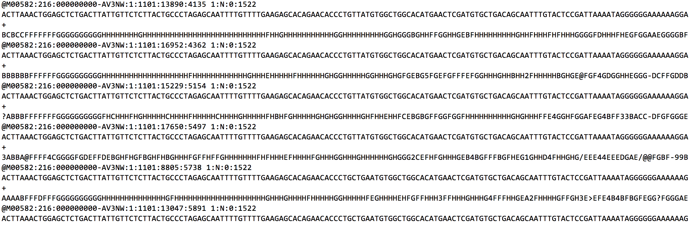

# CollatedMotifs.py

Define alleles for deeply sequenced genetic loci (PCR amplicons), and summarize loss or gain of transcription factor binding site (TFBS) motif matches relative to reference DNA sequence(s).  

## Table of contents
* [Background](#background)
* [Features](#features)
* [Setup](#setup)
* [Requirements](#requirements)
* [Synopsis](#synopsis)
* [Operation notes](#operationnotes)
* [Input notes](#input%20notes)
* [Output notes](#output%20notes)
* [Visual summary of key script operations](#visual%20summary%20of%20key%20script%20operations)
* [Status](#status)
* [Contact](#contact)

## Background  
DNA sequence-selective **transcription factors (TFs)** mediate gene regulation; their interactions with DNA contribute to the formation of nucleoprotein structures that modulate transcription at target genes. These functional units -- **response elements** (*e.g.*, enhancers/*cis*-regulatory modules) -- integrate cellular signals to regulate the types of gene transcripts produced by a cell, and when and how much of each transcript type is made. CRISPR-Cas9 editing routinely yields mixed allelic mutation at target loci (*e.g.*, variable insertion *vs.* deletion, indel length across edited cells). For editing efforts targeted to putative response elements, widely available pattern-matching tools enable prediction of transcription factor binding sites (TFBS) at altered loci, based on matches to position frequency matrices of known TFs. *Awareness of altered TFBS in Cas9-edited alleles can aid prediction and/or interpretation of functional consequences associated with mutations.* 

**This script returns sequence matches to TFBS motifs for samples from a demultiplexed next-generation sequencing (NGS) fastq dataset.  Provided with a reference sequence, the script returns TFBS motif matches collated as 'new' or 'lost' relative to the reference sequence.**  

   
## Features
* Automates allele definitions for amplicons deeply sequenced on Illumina® platforms; identifies matches to TFBS motifs in allele sequences and in user-provided reference sequence(s); presents summation of 'lost' *vs.* 'gained' motif matches in alleles relative to reference sequence.
* Input: demultiplexed fastq files; fasta file(s) containing reference sequence(s) for alignment and TFBS comparison; positional frequency matrix database file (Meme format).
* Outputs: TFBS comparison in alleles relative to reference sequence(s).

## Setup
Code is available as a Jupyter Notebook file (**CollatedMotifs.ipynb**) or as a Python program file (**CollatedMotifs.py**) for direct use, or pre-packaged with all dependencies as an Open Virtualization Format file for virtual machines (**Alleles\_and\_altered\_motifs.ovf**).  

To use: (1) fork and clone this repository to a local destination, or (2) download the file CollatedMotifs.ipynb or CollatedMotifs.py (GitHub) or Alleles\_and\_altered\_motifs.ovf (Zenodo, DOI 10.5281/zenodo.3406862).  

Jupyter Notebook file requires *CollatedMotifs_img* directory containing five image files to be available in the directory from which the Jupyter Notebook was opened.  

*Additional setup*:  

* Locally install **BLASTN**, **MAKEBLASTDB**, **FIMO**, and **FASTA-GET-MARKOV** (see Requirements)  

   

## Requirements
* Python 3 or higher
* BLASTN (NCBI)1  
* FIMO (MEME)2   
* MAKEBLASTDB (NCBI)1  
* FASTA-GET-MARKOV (MEME)2  
   
 1 **BLAST+ suite** available for download @ <a href="https://blast.ncbi.nlm.nih.gov/Blast.cgi?PAGE_TYPE=BlastDocs&DOC_TYPE=Download">Download BLAST Software and Databases</a>)  
 2 **MEME suite** available for download @ <a href="http://meme-suite.org/doc/download.html">Download MEME Suite and Databases</a>)  
 

## Synopsis  
**This script returns alleles and TFBS collated as 'new' or 'lost' relative to a reference sequence, for sample-specific amplicons deeply sequenced on Illumina® sequencing platforms.**
>(see 'Output notes' for file output
details).  

**Users are asked for paths to (1) an output directory, (2) fastq directory (sample sequence sources), (3) BLASTN executable, (4) MAKEBLASTDB executable, (5) FIMO executable, (6) FASTA-GET-MARKOV executable, (7) BLAST reference sequence file (+prefix common to database files), (8) fasta file with reference sequence(s) to be queried as basis for TFBS comparison, and (9) positional frequency matrix file (Meme format) for TFs.**

>(see 'Input notes' for details).

For further usage details, please refer to the following manuscript:  
>*Ehmsen, Knuesel, Martinez, Asahina, Aridomi, Yamamoto (2019)*
    
Please cite usage as:  
>CollatedMotifs.py  
>*Ehmsen, Knuesel, Martinez, Asahina, Aridomi, Yamamoto (2019)*
 

## Operation notes
*What does this script do?*  

 1. **classify & count reads:** merges R1 and R2 sequences into single read, counts unique read types per well (*i.e.*, sample); fastq file name provides the sample name  
 
 
 2. **identify top 5 reads** per well (in terms of read abundance); calculates representation among reads within the well at four levels:  
 
   (a) raw frequency (% read type in question, relative to total reads)  
   (b) percentile (% of other read types that fall below the frequency of the read type in question)  
   (c) adjusted frequency @ 1% (% read type in question, relative to reads that occur at >1% total frequency)  
   (d) adjusted frequency @ 10% (% read type in question, relative to reads that occur at >10% total frequency)  
 
 
 3. **align to reference database:** aligns top 5 reads to reference genome using BLASTN  
 *(National Center for Biotechnology Information;
    Altschul S.F. et al. (1990) "Basic local alignment search tool")*  
       * Alignment database is created within the script by MAKEBLASTDB, from user-provided, fasta-formatted reference sequence(s)

 
 
 
 
 
 
 
 
 4. **identify TFBS in reference and allele sequences:** for user-provided reference sequences, uses FIMO and user-provided positional frequency matrix file to find matches to TFBS motifs  
     *(FIMO; Grant C.E. et al. (2011) "FIMO: Scanning for occurrences of a given motif", Bioinformatics 27(7):1017–1018)*  
    *(MEME Suite; Bailey T.L. et al. (2015) "The MEME Suite", Nucleic Acids Res 43(Web Server issue):W39–W49)*  
    * Background Markov file for TFBS match statistics is created within the script by FASTA-GET-MARKOV, from user-provided, fasta-formatted reference sequence(s)  

 
 
 
 5. **return collation of novel *vs.* lost TFBS:** compares TFBS in reads to TFBS in specific reference sequence, outputting 'new' and 'lost' TFBS relative to the reference sequence.
 
 
        
**Operations overview:** *See 
Input notes' and 'Output notes'*  
'collated\_TFBS.txt' (file labeled *i* below): Key output file containing script interpretations of sample alleles & TFBS collation ('new' *vs.* 'lost' relative to reference sequence(s)).
 

 

## Input notes
You will be prompted for the following user-specific information (10 items):

**Required** (10 strings: 9 strings specifying directory, executable, or file locations, + 1 string specifying prefix to be assigned to BLASTN database files):  

   paths to directories (2)
      <ul>
      <li>where should output files go?</li>
          *path to* **output directory** *for output files*
      <li>where are input files found?</li>
          *path to single directory containing* **demultiplexed fastq files**  
      </ul>

   paths to executables (4)  
      <ul>
      <li>where is BLASTN executable found?</li>
          *path to* **BLASTN** *installation*
      <li>where is MAKEBLASTDB executable found?</li>
          *path to* **MAKEBLASTDB** *installation*
      <li>where is FIMO executable found?</li>
          *path to* **FIMO** *installation*
      <li>where is FASTA-GET-MARKOV executable found?</li>
          *path to* **FASTA-GET-MARKOV** *installation*
      </ul>
      
   paths to files (3)
      <ul>
      <li>what are your reference sequence(s), to which you will (a) align sequenced reads, and (b) compare sequenced reads for TFBS occurrence?</li>
          *path to single fasta file, containing reference sequence(s) for processing by (a) MAKEBLASTDB, to generate a database reference for BLASTN, and (b) FIMO, to establish TFBS occurrence(s) to be evaluated relative to sequenced reads*
      <li>what are the TFBS motif(s) for which you will search, and for which you will draw comparisons for presence/absence between sequences?</li>
          *path to single text file, containing position frequency matrix(ces) for TFs (Meme format)*
      <li>what DNA sequence(s) will you use as a basis for markov background estimation, to be used by FIMO</li>
          *path to single text/fasta file, containing DNA sequence(s) from which a markov background file will be generated for use by FIMO*    
      </ul>

   label for database files created in 'alignment_directory' by MAKEBLASTDB (1)
      <ul>
      <li>what common prefix (\*) will you assign to the six files (*.nin, *.nhr, *.nog, *.nsd, *.nsg, *.nsi) created by MAKEBLASTDB, as the alignment database for BLASTN?</li>
     </ul>

## Output notes
This script produces 5 output files in the user-specified output directory, plus three sub-directories:  

  - **3 sub-directories** comprise outputs of MAKEBLASTDB and FIMO:  
  
    - two directories contain FIMO output files (fimo_out and fimo_out_ref); each of these sub-directories contains 5 subsidiary files created by FIMO (cisml.xml, fimo.gff, fimo.html, fimo.tsv, fimo.xml)  
    - one directory comprises BLASTN alignment database (alignment_databse); this directory contains 6 subsidiary files created by MAKEBLASTDB operation on user-supplied fasta file containing reference sequence(s) (\*.nin, \*.nhr, \*.nog, \*.nsd, \*.nsg, \*.nsi)  
  
  - **5 output files** in the user-specified output directory; these include:
     
  
    1. **fasta.fa**  
        (collection of fasta entries representing top 5 most abundant sequences assigned to a single sample ID)  

	2. **blastn_alignments.txt**  
        (output of BLASTN operation on fasta.fa)  
        
   3. **markov_background.txt**  
        (output of FASTA-GET-MARKOV operation on user-supplied fasta reference file)  
        
   4. **collated_TFBS.txt**  
        (*key output*; output of script operation on FIMO-generated .tsv files in fimo\_out and fimo\_out\_ref)  
        
   5. **script_metrics.txt**  
        (summary/analysis of script operation metrics \[metadata\])

       Directory structure under an output directory specified as 'CollatedMotifs', for example,
       would contain the following subdirectories and files following CollatedMotifs.py operations:

              /CollatedMotifs 
                          `-----/alignment_database
                                        `----------*.nin
                                        `----------*.nhr
                                        `----------*.nog
                                        `----------*.nsd
                                        `----------*.nsg
                                        `----------*.nsi
                          `-----blastn_alignments.txt
                          `-----collated_TFBS.txt
                          `-----fasta.fa
                          `-----/fimo_out
                                        `----------cisml.xml
                                        `----------fimo.gff
                                        `----------fimo.html
                                        `----------fimo.tsv
                                        `----------fimo.xml
                          `-----/fimo_out_ref
                                        `----------cisml.xml
                                        `----------fimo.gff
                                        `----------fimo.html
                                        `----------fimo.tsv
                                        `----------fimo.xml
                          `-----markov_background.txt
                          `-----script_metrics.txt

## Visual summary of key script operations
In short, sequencing data in a sample-specific **fastq file** (*e.g.*, below), are converted to user-interpretable allele definitions annotated with 'new' and 'lost' TFBS relative to a reference sequence (**key output file**, below), for 100s to 1000s of samples.    
  

   
*example*  

------
#### Key output files:  
##### collated_TFBS.txt 
Samples are reported with sequence alignments to document alleles, along with 'new' and 'lost' TFBS relative to a reference sequence. 

 

## Status
Project is:  _finished_, _open for contributions_

## Contact
Created by kirk.ehmsen[at]gmail.com - feel free to contact me!    
Keith Yamamoto laboratory, UCSF, San Francisco, CA.