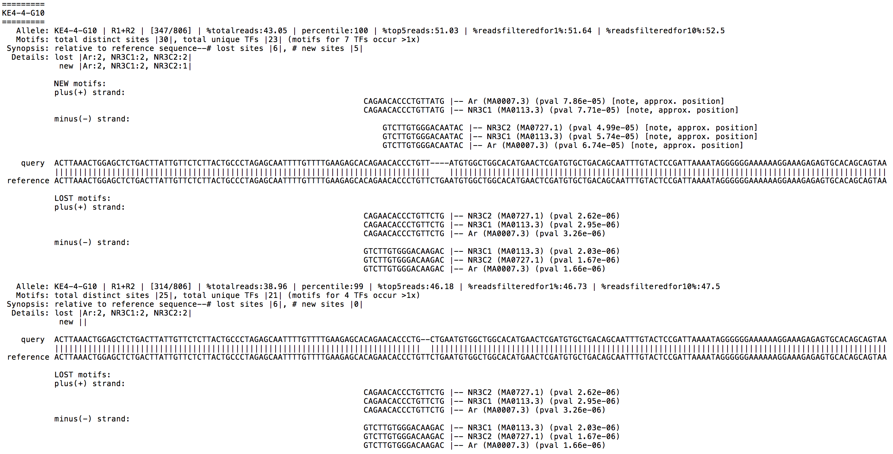

#  <span style="color:darkturquoise">CollatedMotifs.py</span>

Define alleles for deeply sequenced genetic loci (PCR amplicons), and summarize loss or gain of transcription factor binding site (TFBS) motif matches relative to reference DNA sequence(s).  

## <span style="color:mediumturquoise">Table of contents</span>
* [Background](#background)
* [Features](#features)  
* [Requirements](#requirements)
* [Synopsis](#synopsis)
* [System setup](#system%20setup)
* [Code launch notes](#codelaunchnotes)
* [Operation notes](#operationnotes)
* [Input notes](#input%20notes)
* [Output notes](#output%20notes)
* [Visual summary of key script operations](#visual%20summary%20of%20key%20script%20operations)
* [Status](#status)
* [Contact](#contact)

## <span style="color:mediumturquoise">Background  </span>
DNA sequence-selective **transcription factors (TFs)** mediate gene regulation; their interactions with DNA contribute to the formation of nucleoprotein structures that modulate transcription at target genes. These functional units -- **response elements** (*e.g.*, enhancers/*cis*-regulatory modules) -- integrate cellular signals to regulate the types of gene transcripts produced by a cell, and when and how much of each transcript type is made. Genomic editing by programmable nucleases (*e.g.*, CRISPR-Cas9) routinely yields mixed allelic mutation at target loci (*e.g.*, variable insertion *vs.* deletion, indel length across edited cells). For editing efforts targeted to putative response elements, widely available pattern-matching tools enable prediction of transcription factor binding sites (TFBS) at altered loci, based on matches to position frequency matrices of known TFs. *Awareness of altered TFBS in edited alleles can aid prediction and/or interpretation of functional consequences associated with mutations.* 

**This script returns sequence matches to TFBS motifs for samples from a demultiplexed next-generation sequencing (NGS) fastq dataset.  Provided with a reference sequence, the script returns TFBS motif matches collated as 'new' or 'lost' relative to the reference sequence.**  

<br clear="all" />
  
## <span style="color:mediumturquoise">Features</span>
* Automates allele definitions for amplicons deeply sequenced on Illumina® platforms; identifies matches to TFBS motifs in allele sequences and in user-provided reference sequence(s); presents summation of 'lost' *vs.* 'gained' motif matches in alleles relative to reference sequence.
* Input: demultiplexed fastq files; fasta file(s) containing reference sequence(s) for alignment and TFBS comparison; positional frequency matrix database file (MEME format).
* Outputs: TFBS comparison in alleles relative to reference sequence(s).


## <span style="color:mediumturquoise">Requirements</span>
* Python 3 or higher
* BLASTN (NCBI)<sup>1</sup>  
* FIMO (MEME)<sup>2</sup>   
* MAKEBLASTDB (NCBI)<sup>1</sup>  
* FASTA-GET-MARKOV (MEME)<sup>2</sup>  
   
 <sup>1</sup> **BLAST+ suite** available for download @ <a href="https://blast.ncbi.nlm.nih.gov/Blast.cgi?PAGE_TYPE=BlastDocs&DOC_TYPE=Download">Download BLAST Software and Databases</a>)  
 <sup>2</sup> **MEME suite** available for download @ <a href="http://meme-suite.org/doc/download.html">Download MEME Suite and Databases</a>)  
 

## <span style="color:mediumturquoise">Synopsis</span>  
**This script returns alleles and TFBS collated as 'new' or 'lost' relative to a reference sequence, for sample-specific amplicons deeply sequenced on Illumina® sequencing platforms.**
>(see 'Output notes' for file output
details).  


**Users are asked for paths to (1) an output directory, (2) fastq directory (sample sequence sources), (3) BLASTN executable, (4) MAKEBLASTDB executable, (5) FIMO executable, (6) FASTA-GET-MARKOV executable, (7) BLAST reference sequence file (+prefix common to database files), (8) fasta file with reference sequence(s) to be queried as basis for TFBS comparison, and (9) positional frequency matrix file (MEME format) for TFs.**

>(see 'Input notes' for details).

For further usage details, please refer to the following manuscript:  
>*Ehmsen, Knuesel, Martinez, Asahina, Aridomi, Yamamoto (2020)*
    
Please cite usage as:  
>CollatedMotifs.py  
>*Ehmsen, Knuesel, Martinez, Asahina, Aridomi, Yamamoto (2020)*
 
 
## <span style="color:mediumturquoise">System setup</span>

#### <span style="color:turquoise">1. Confirm that Python 3 and Jupyter Notebook are available on your system, or download & install</span>
##### Mac or Windows OS

**Python 3**  
Mac OS generally comes with Python pre-installed, but Windows OS does not.  Check on your system for the availability of Python version 3.7 or higher by following guidelines below:
 
- First open a console in Terminal (Mac OS) or Command Prompt/CMD (Windows OS), to access the command line interface.
 
-  Check to see which version of Python your OS counts as default by issuing the following command (here, `$` refers to your command-line prompt and is not a character to be typed):  
     
	`$ python --version` 
	 
 	- If the output reads `Python 3.7.3` or any version >=3.7, you are good to go and can proceed to **Jupyter Notebook**.
 
 	- If the output reads `Python 2.7.10` or anything below Python 3, this signifies that a Python version <3 is the default version, and you will need to check whether a Python version >=3.7 is available on your system.
 		- To check whether a Python version >=3.7 is available on your system, issue the following command:  
 
 			`$ python3 --version`  
 
 		- If the output finds a Python version >=3.7 (such as `Python 3.7.3`), you are good to go and can proceed to **Jupyter Notebook**.
		- If the output does *not* find a Python version >3.7, use one of the following two options to download and install Python version >=3.7 on your computer: 
  
 			1- *To install Python 3 alone (separately from Jupyter Notebook)*
 
 			[Python](https://www.python.org/downloads/) https://www.python.org/downloads/
 			- "Download the latest version for Mac OS X", and then follow installation guidelines and prompts when you double-click the downloaded package to complete installation.  
 
 			- Once you have downloaded and installed a Python 3 version >=3.7, double-check in your command-line that Python 3 can be found on your system by issuing the following command:  
 	
 				`$ python3 --version` (Mac OS)  
 				`$ python --version` (Windows OS)
  
 				The output should signify the Python version you just installed.  Proceed to **Jupyter Notebook**.
 
 			2- *To install Python 3 and Jupyter Notebook all at once* (**recommended**)
 
			[Anaconda (with Jupyter Notebook) Download & Installation](https://jupyter.readthedocs.io/en/latest/install/notebook-classic.html) https://jupyter.readthedocs.io/en/latest/install/notebook-classic.html

 			- Download Anaconda with Python 3, and then follow installation guidelines and prompts when you double-click the downloaded package to complete installation.  
 
 			- Once you have downloaded and installed Python 3, double-check in your command-line that Python 3 can be found on your system by issuing the following command: 
  	
				`$ python3 --version` (Mac OS)  
				`$ python --version` (Windows OS)  

 			- Also double-check in your command-line that Jupyter Notebook can be found on your system by issuing the following command:  
 	
 				`$ which jupyter notebook`
 
			- If the output indicates that 'jupyter' is available in the path of your Python 3 installation (such as, `/Library/Frameworks/Python.framework/Versions/3.7/bin/jupyter`), you are good to go and can proceed to **2. Configure Python Virtual Environment for Jupyter Notebook**.  

**Jupyter Notebook**  
*Note, these steps are not required if you installed Anaconda with Jupyter Notebook as recommended above*.  Jupyter Notebook is *not* generally pre-installed on Mac OS.  To check whether Jupyter Notebook is available with Python 3 on your machine, issue the following command:
 
 	$ which jupyter notebook
 
If the output indicates that 'jupyter' is available in the path of your Python 3 installation (such as, `/Library/Frameworks/Python.framework/Versions/3.7/bin/jupyter`), you are good to go and can proceed to **2. Configure Python Virtual Environment for Jupyter Notebook**.  If instead you see an error message indicating that 'jupyter notebook' is not available, issue the following commands using the Python program installer (pip) to install Jupyter: 
  
 	$ pip3 install --upgrade pip  
	$ pip3 install jupyter


<br> 
#### <span style="color:turquoise">2. Download the CollatedMotifs repository (or program file subset) from GitHub</span>

CollatedMotifs.py can be accessed as a **Jupyter Notebook** or **Python program file** available at [YamamotoLabUCSF GitHub](https://github.com/YamamotoLabUCSF/CollatedMotifs) (https://github.com/YamamotoLabUCSF/CollatedMotifs).  Please note that access to the file through GitHub requires a personal GitHub account.  

* (a) **Create a personal GitHub account** (free)  
	* follow instructions available at [WikiHow: How to Create an Account on GitHub](https://www.wikihow.com/Create-an-Account-on-GitHub) https://www.wikihow.com/Create-an-Account-on-GitHub. 

* (b) **Navigate to the code repository for CollatedMotifs**
	* The code repository contains:
		* the **Jupyter Notebook** file (.ipynb)
		* the **Python program** file (.py)
		* **image files** associated with the Jupyter Notebook
		* a **requirements** file (CollatedMotifs_requirements.txt), used in the creation of a Python virtual environment to run CollatedMotifs (see **3. Configure Python Virtual Environment for Jupyter Notebook**, below)
		
* (c) **Download** or **clone** the repository to your personal computer:  

	**Download:**   
	* first click on the repository name	 to access the repository
	* then download the entire repository directory and its associated subdirectories and files (**green download icon, labeled "Code"**)
	* alternatively, download only the target files you need for your intended purposes 
	  * for example, download the **Jupyter Notebook** file (.ipynb), **image files directory**, and **requirements** file if you plan to use only the Jupyter Notebook

	**Clone:**   
	  
	* first click on the repository name	 to access the repository
	* then click on the right-hand arrow of the **green download icon, labeled "Code"**, to access the drop-down menu with **Clone** options (HTTPS or GitHub CLI).
	* If selecting the HTTPS option, copy the indicated URL and paste it at your command-line as an argument to the command 'git clone':  
	`$ git clone https://github.com/YamamotoLabUCSF/CollatedMotifs.git` 

* (d) **Choose a directory location** on your machine where you would like to store the downloaded or cloned repository and its files.  This can be any folder/directory location you like.  **Move the repository files from the directory into which they were downloaded or cloned, into this directory**, if you have not already downloaded or cloned the repository/files directly into your target directory.  

	*Example using command line code*  
	*(directory can be created and accessed using command line prompts)*   
	* For example, on Mac OS:  
	
		* To create an empty directory named 'CollatedMotifsCode', in the 'Documents' directory:*  
	`$ mkdir /Users/yourusername/Documents/CollatedMotifsCode`
		* To navigate to the directory named 'CollatedMotifs':	`$ cd /Users/yourusername/Documents/CollatedMotifsCode`

	* For example, on Windows OS:  
	 
		* To create an empty directory named 'CollatedMotifsCode', in the 'Documents' directory:  
	`$ mkdir C:\Documents\CollatedMotifs`
		* To navigate to the directory named 'CollatedMotifsCode':  
		`$ cd C:\Documents\CollatedMotifsCode`

* (e) With the CollatedMotifs repository files now present in this directory you've created and named, now navigate to the **CollatedMotifs** repository in the command line, by issuing the following command:  

	`$ cd /Users/yourusername/Documents/CollatedMotifsCode/CollatedMotifs` (Mac OS)  
	or  
	`$ cd C:\Documents\CollatedMotifsCode\CollatedMotifs` (Windows OS)
 
<br>
 
#### <span style="color:turquoise">3. Create a Python Virtual Environment for Jupyter Notebook</span>

You are now ready to install **additional Python modules** that CollatedMotifs.py requires for operation.  These Python modules can be installed from the Python Package Index repository ([PyPI](https://pypi.org/)) (https://pypi.org/) by individual download from the PyPI website and installation on your machine.  However, to simplify and streamline installation of these modules, we will create a Python **virtual environment** (self-contained 'directory' with all the Python modules needed to run CollatedMotifs.py), using the following approach:

1.  First, install the Python module **virtualenv** ([virtualenv](https://pypi.org/project/virtualenv/)) (https://pypi.org/project/virtualenv/), by issuing the following command at the command line: 
 
	`$ pip3 install virtualenv`  (Mac OS)  
	or  
	`$ pip install virtualenv`  (Windows OS)
	
	pip3 (Mac OS) or pip (Windows OS) is Python 3's installation manager, and as long as there is an internet connection available, pip3 (Mac OS) or pip (Windows OS) will access the specified module from PyPI (here, virtualenv) and install it for access by Python 3.

2. Next, choose a **directory location** on your machine where you would like to install the files associated with a virtual environment.  This can be any folder/directory location you like (for example, you may have a favorite directory where other Python virtual environments are stored).  Alternatively, simply create the Python virtual environment in the CollatedMotifs directory you created above (in section 2d).  At the command line, navigate to the location of this directory.  
	* For example, on Mac OS:  
		* To navigate to the directory named 'CollatedMotifsCode':	`$ cd /Users/yourusername/Documents/CollatedMotifsCode`

	* For example, on Windows OS:  

		* To navigate to the directory named 'CollatedMotifsCode':  
		`$ cd C:\Documents\CollatedMotifsCode`

3. With this directory set as your working location in the command line, now issue the following commands to **create a virtual environment**:  
	
	(a) Create a Python virtual environment named **CollatedMotifs_env**, specifying that the environment will use Python 3:  
	`virtualenv -p python3 CollatedMotifs_env` 
	
	(b) Activate CollatedMotifs_env:   
	`source CollatedMotifs_env/bin/activate`  (Mac OS)  
	or  
	`.\CollatedMotifs_env\Scripts\activate`  (Windows OS) 	
	
	(c) You should now see that your command line prompt has changed to indicate that you are in the virtual environment, displaying something along the lines of:  
	`(CollatedMotifs_env) $`
	
	(d) Now install the Python modules required by CollatedMotifs.py, using the requirements file named **CollatedMotifs_requirements.txt**, located in the CollatedMotifs repository:
	   
	`$ pip3 install -r CollatedMotifs/CollatedMotifs_requirements.txt` (Mac OS)   
	or  
	`$ pip install -r CollatedMotifs/CollatedMotifs_requirements.txt`  (Windows OS)  	
	
	(e) To check that the required CollatedMotifs.py Python modules were installed properly, now issue the follow command:
	
	`$ pip3 list`  (Mac OS)  
	or  
	`$ pip list`  (Windows OS)  	
	
	If the virtual environment was set up successfully, the output will read: 
	  
  **Package    Version**    
  numpy      1.19.2  
  pip        20.3.1  
  psutil     5.7.2  
  scipy      1.5.2  
  setuptools 50.3.2  
  wheel      0.36.0   


4.  Finally, Jupyter Notebook needs to be made aware of the Python virtual environment you just created.  To accomplish this, issue the following commands:  

    (Mac OS)   
	```$ pip3 install ipykernel```   
	```$ python -m ipykernel install --name=CollatedMotifs_env```  

    (Windows OS)   
	```$ pip install ipykernel```   
	```$ python -m ipykernel install --user --name CollatedMotifs_env``` 


5.  You should now be ready to **access CollatedMotifs.py** in Jupyter Notebook or at the command line!  See **Using CollatedMotifs.py**.

6. Just for completeness, to **exit the Python virtual environment and return to your 'native' (default) environment**, simply issue the following command at the command line:

	``$ deactivate`` 
	
	To **re-enter the virtual environment** at any time in the future, you would use the command in 3b:
	
	`source CollatedMotifs_env/bin/activate`  (Mac OS)  
	or  
	`.\CollatedMotifs_env\Scripts\activate`  (Windows OS) 

7. Also, note that if you'd like **to remove the CollatedMotifs_env at any time**, you can do so by issuing the following command:  

	```$ rm -rf CollatedMotifs_env``` 

	This would delete the virtual environment from your machine.

#### <span style="color:turquoise">4. Download & install external dependencies (BLAST, MEME)</span>

*Additional setup*:  

* Locally install **BLASTN**, **MAKEBLASTDB**, **FIMO**, and **FASTA-GET-MARKOV** (see **Requirements** above)  

<br clear="all" />
    * *Note, separate installation of these external dependencies is not necessary if using the virtual machine file Alleles\_and\_altered\_motifs.ovf*


<br>

##<span style="color:mediumturquoise">Code launch notes</span>  
Code is available as a Jupyter Notebook file (**CollatedMotifs.ipynb**) or as a Python program file (**CollatedMotifs.py**) for direct use, or pre-packaged with all dependencies as an Open Virtualization Format file for virtual machines (**Alleles\_and\_altered\_motifs.ovf**).  

#### <span style="color:turquoise">Jupyter Notebook or Python program file</span>

In **System Set-Up** above, you downloaded and installed Python 3, Jupyter Notebook, & the CollatedMotifs code repository, and created a Python virtual environment (CollatedMotifs\_env) containing the Python modules that CollatedMotifs.py needs in order to run.  To access CollatedMotifs.py (Jupyter Notebook or Python program file) for interactive work, proceed through guidelines indicated below.  

#### <span style="color:turquoise">Jupyter Notebook</span>

*Note*, Jupyter Notebook file requires *CollatedMotifs_img* directory containing five image files to be available in the directory from which the Jupyter Notebook will be opened.  

**Anaconda Navigator**

1.  If you downloaded **Anaconda (with Jupyter Notebook)** as recommended in System Setup above, launch the Anaconda-Navigator application.  Click on **Jupyter Notebook** to activate Jupyter Notebook.  

2.  You will see a new **tab open automatically in your default web browser** (such as Chrome), in which there is a **directory tree** illustrating the current file contents of the **current working** directory.  Navigate to the directory containing **CollatedMotifs.ipynb**.  Click on the **CollatedMotifs.ipynb** file to open it as a Jupyter Notebook.

3. In the Jupyter Notebook menu bar at the top of the newly opened CollatedMotifs.py Jupyter Notebook file, take the following steps to **specify CollatedMotifs_env as your Python virtual environment** (see System Setup: 3. Create a Python Virtual Environment for Jupyter Notebook):  

	(a) click on the **'Kernel'** tab to open a drop-down menu  
	(b) hover your mouse over **'Change Kernel'** (bottom option of drop-down menu) to identify the kernels available to the Notebook  
	(c) choose **CollatedMotifs_env** as the kernel  
	 
	 If CollatedMotifs_env does not appear as a kernel option, troubleshooting is needed to either create the CollatedMoitfs_env virtual environment, or to make Jupyter Notebook aware of the existence of the CollatedMotifs_env virtual environment.

4.  If these steps have been accomplished successfully, you are now ready to use the CollatedMotifs.py Jupyter Notebook.  Be prepared to provide required input variables as detailed below in **Input Notes**.
<br>

**Command Line**  

1.  If you plan to activate Jupyter Notebook from your command line, first navigate to the directory containing **CollatedMotifs.ipynb**.  For example, if you downloaded the code repository as **CollatedMotifs** and are not already in **CollatedMotifs** as your working (current) directory at the command line, **navigate** there at this time using commands similar to the following:

	* For example, on Mac OS:  
	`$ cd /Users/yourusername/Documents/CollatedMotifsCode/CollatedMotifs`

	* For example, on Windows OS:  
	`$ cd C:\Documents\CollatedMotifsCode/CollatedMotifs`
	
	You can **check your current working directory** by issuing the following command:  
	
	`$ pwd`

2.  To further confirm that you are in the repository directory at the command line, you can **check the files** present in the repository directory by issuing the following command:  

	`$ ls` (Mac OS)  
	`$ dir` (Windows OS)	
	
	You should see a list of files that includes the CollatedMotifs Jupyter Notebook and/or Python program file (depending on whether you downloaded the repository or individual program files), named **CollatedMotifs.ipynb** or  **CollatedMotifs.py**
	
3.  Activate Jupyter Notebook by issuing the following command:  

	`jupyter notebook`  (Mac OS, in Terminal)
	
4.  Refer to steps 2-4 under "Anaconda Navigator" approach above.  

#### <span style="color:turquoise">Python program file</span>
**Anaconda Navigator**

1.  If you downloaded **Anaconda (with Jupyter Notebook)** as recommended in System Setup above, launch the Anaconda-Navigator application.  Click on **Jupyter Notebook** to activate Jupyter Notebook.  

2.  You will see a new **tab open automatically in your default web browser** (such as Chrome), in which there is a **directory tree** illustrating the current file contents of the **current workin

**Command Line**  

1.  If you plan to run CollatedMotifs.py from your command line, first navigate to the directory containing **CollatedMotifs.py**.  Prepare access to a Python virtual environment containing appropriate packages required by CollatedMotifs.py, as described in System Setup.  

    (a) Activate CollatedMotifs_env:   
	`source CollatedMotifs_env/bin/activate`  (Mac OS)  
	or  
	`.\CollatedMotifs_env\Scripts\activate`  (Windows OS) 	
	
	(b) You should now see that your command line prompt has changed to indicate that you are in the virtual environment, displaying something along the lines of:  
	`(CollatedMotifs_env) $`

2.  To run CollatedMotifs.py, type **python3 CollatedMotifs.py** and hit 'Enter':
	`(CollatedMotifs_env) $ python3 CollatedMotifs.py`  
	
3.  If these steps have been accomplished successfully, you will now encounter the first interactive prompts of CollatedMotifs.py.  Be prepared to provide required input variables as detailed below in **Input Notes**.


#### <span style="color:turquoise">Virtual machine (Alleles\_and\_altered\_motifs.ovf)</span>

1. To access the virtual machine that comes pre-installed with external dependencies (and is the only way to run CollatedMotifs on Windows OS, because MEME suite software does not run on Windows OS), **download the file Alleles\_and\_altered\_motifs.ovf** (**Zenodo, DOI 10.5281/zenodo.3406862**). *Note: this requires virtualization software, such as Oracle VM VirtualBox*

2. Instructions for how to set up the virtual machine (including username and password for ovf file) can be found in the Zenodo repository.    

##<span style="color:mediumturquoise">Operation notes</span>  
*What does this script do?*  

 1. **classify & count reads:** merges R1 and R2 sequences into single read, counts unique read types per well (*i.e.*, sample); fastq file name provides the sample name  
 
 
 2. **identify top 5 reads** per well (in terms of read abundance); calculates representation among reads within the well at four levels:  
 
   (a) raw frequency (% read type in question, relative to total reads)  
   (b) percentile (% of other read types that fall below the frequency of the read type in question)  
   (c) adjusted frequency @ 1% (% read type in question, relative to reads that occur at >1% total frequency)  
   (d) adjusted frequency @ 10% (% read type in question, relative to reads that occur at >10% total frequency)  
 
 
 3. **align to reference database:** aligns top 5 reads to reference genome using BLASTN  
 *(National Center for Biotechnology Information;
    Altschul S.F. et al. (1990) "Basic local alignment search tool")*  
       * Alignment database is created within the script by MAKEBLASTDB, from user-provided, fasta-formatted reference sequence(s)

<br/>
<br/>
<br/>
<br/>
<br/>
<br/>
<br/>
<br/>
 4. **identify TFBS in reference and allele sequences:** for user-provided reference sequences, uses FIMO and user-provided positional frequency matrix file to find matches to TFBS motifs  
     *(FIMO; Grant C.E. et al. (2011) "FIMO: Scanning for occurrences of a given motif", Bioinformatics 27(7):1017–1018)*  
    *(MEME Suite; Bailey T.L. et al. (2015) "The MEME Suite", Nucleic Acids Res 43(Web Server issue):W39–W49)*  
    * Background Markov file for TFBS match statistics is created within the script by FASTA-GET-MARKOV, from user-provided, fasta-formatted reference sequence(s)  

<br/>
<br/>
<br/>
 5. **return collation of novel *vs.* lost TFBS:** compares TFBS in reads to TFBS in specific reference sequence, outputting 'new' and 'lost' TFBS relative to the reference sequence.
<br/>
<br/>
        
**Operations overview:** *See 
Input notes' and 'Output notes'*  
'collated\_TFBS.txt' (file labeled *i* below): Key output file containing script interpretations of sample alleles & TFBS collation ('new' *vs.* 'lost' relative to reference sequence(s)).
<br/>

<br clear="all" />

##<span style="color:mediumturquoise">Input notes</span>
You will be prompted for the following user-specific information (10 items):

**Required** (10 strings: 9 strings specifying directory, executable, or file locations, + 1 string specifying prefix to be assigned to BLASTN database files):  

   paths to directories (2)
      <ul>
      <li>where should output files go?</li>
          *path to* **output directory** *for output files*
      <li>where are input files found?</li>
          *path to single directory containing* **demultiplexed fastq files**  
      </ul>

   paths to executables (4)  
      <ul>
      <li>where is BLASTN executable found?</li>
          *path to* **BLASTN** *installation*
      <li>where is MAKEBLASTDB executable found?</li>
          *path to* **MAKEBLASTDB** *installation*
      <li>where is FIMO executable found?</li>
          *path to* **FIMO** *installation*
      <li>where is FASTA-GET-MARKOV executable found?</li>
          *path to* **FASTA-GET-MARKOV** *installation*
      </ul>
      
   paths to files (3)
      <ul>
      <li>what are your reference sequence(s), to which you will (a) align sequenced reads, and (b) compare sequenced reads for TFBS occurrence?</li>
          *path to single fasta file, containing reference sequence(s) for processing by (a) MAKEBLASTDB, to generate a database reference for BLASTN, and (b) FIMO, to establish TFBS occurrence(s) to be evaluated relative to sequenced reads*
      <li>what are the TFBS motif(s) for which you will search, and for which you will draw comparisons for presence/absence between sequences?</li>
          *path to single text file, containing position frequency matrix(ces) for TFs (Meme format)*
      <li>what DNA sequence(s) will you use as a basis for markov background estimation, to be used by FIMO</li>
          *path to single text/fasta file, containing DNA sequence(s) from which a markov background file will be generated for use by FIMO*    
      </ul>

   label for database files created in 'alignment_directory' by MAKEBLASTDB (1)
      <ul>
      <li>what common prefix (\*) will you assign to the six files (*.nin, *.nhr, *.nog, *.nsd, *.nsg, *.nsi) created by MAKEBLASTDB, as the alignment database for BLASTN?</li>
     </ul>

##<span style="color:mediumturquoise">Output notes</span>
This script produces 5 output files in the user-specified output directory, plus three sub-directories:  

  - **3 sub-directories** comprise outputs of MAKEBLASTDB and FIMO:  
  
    - two directories contain FIMO output files (fimo_out and fimo_out_ref); each of these sub-directories contains 5 subsidiary files created by FIMO (cisml.xml, fimo.gff, fimo.html, fimo.tsv, fimo.xml)  
    - one directory comprises BLASTN alignment database (alignment_databse); this directory contains 6 subsidiary files created by MAKEBLASTDB operation on user-supplied fasta file containing reference sequence(s) (\*.nin, \*.nhr, \*.nog, \*.nsd, \*.nsg, \*.nsi)  
 <br clear="all" />
  - **5 output files** in the user-specified output directory; these include:
     
  
    1. **fasta.fa**  
        (collection of fasta entries representing top 5 most abundant sequences assigned to a single sample ID)  

	2. **blastn_alignments.txt**  
        (output of BLASTN operation on fasta.fa)  
        
   3. **markov_background.txt**  
        (output of FASTA-GET-MARKOV operation on user-supplied fasta reference file)  
        
   4. **collated_TFBS.txt**  
        (*key output*; output of script operation on FIMO-generated .tsv files in fimo\_out and fimo\_out\_ref)  
        
   5. **script_metrics.txt**  
        (summary/analysis of script operation metrics \[metadata\])

       Directory structure under an output directory specified as 'CollatedMotifs', for example,
       would contain the following subdirectories and files following CollatedMotifs.py operations:

              /CollatedMotifs 
                          `-----/alignment_database
                                        `----------*.nin
                                        `----------*.nhr
                                        `----------*.nog
                                        `----------*.nsd
                                        `----------*.nsg
                                        `----------*.nsi
                          `-----blastn_alignments.txt
                          `-----collated_TFBS.txt
                          `-----fasta.fa
                          `-----/fimo_out
                                        `----------cisml.xml
                                        `----------fimo.gff
                                        `----------fimo.html
                                        `----------fimo.tsv
                                        `----------fimo.xml
                          `-----/fimo_out_ref
                                        `----------cisml.xml
                                        `----------fimo.gff
                                        `----------fimo.html
                                        `----------fimo.tsv
                                        `----------fimo.xml
                          `-----markov_background.txt
                          `-----script_metrics.txt

##<span style="color:mediumturquoise">Visual summary of key script operations</span>
In short, sequencing data in a sample-specific **fastq file** (*e.g.*, below), are converted to user-interpretable allele definitions annotated with 'new' and 'lost' TFBS relative to a reference sequence (**key output file**, below), for 100s to 1000s of samples.    
  

<br clear="all" />  
*example*  

------
#### Key output files:  
##### collated_TFBS.txt 
Samples are reported with sequence alignments to document alleles, along with 'new' and 'lost' TFBS relative to a reference sequence. 

<br clear="all" />

##<span style="color:mediumturquoise">Status</span>
Project is:  _finished_, _open for contributions_


##<span style="color:mediumturquoise">Contact</span>
Created by kirk.ehmsen[at]gmail.com - feel free to contact me!    
Keith Yamamoto laboratory, UCSF, San Francisco, CA.